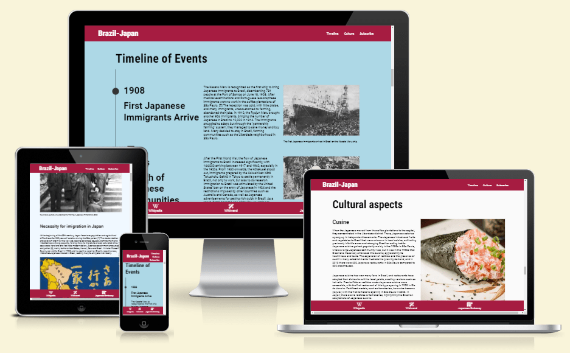
# Japanese - Brazilian migration

Japanese - Brazilian Migration is a website designed to inform people about the rich history of connection between these two countries from across the planet. It will be targeted for those who are interested in the topic, including pupils, researchers and the history buff. 
The website will be useful to understand:
- The before - what pushed people to leave their homes
- During - how was the migration and settling process
- and after - how did the population integrate and change its new home 

## Features
- Navigation bar
    - The navigation bar sits at the top of the page.
    - It is fixed at the top, allowing the user to always have access to the links, easing the navigation through website.
    - It includes a link back to the top of the page on the left side.
    - It includes three links to the different sections of the website: Timeline, Culture and Subscribe.
    - The monochromatic and darker background provides contrast with the white text.
    - The links are clear on their meaning and connection with their respective sections.

    

- Banner
    - The banner show the name and theme of the website, informing the user what they can expect to find.
    - The font and color scheme are kept in correspondence with the rest of the page.
    - The image displayed is colorful and representative of the topic.

    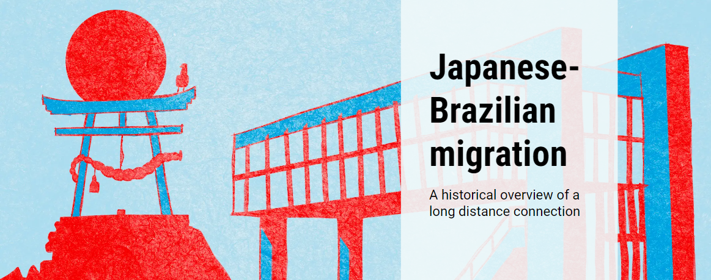
- Historical Background
    - The "Historical Background" section of the page is a short introduction to the topic, improving understanding of the following timeline.
    - It displays two historical images that draw the user's attention.

    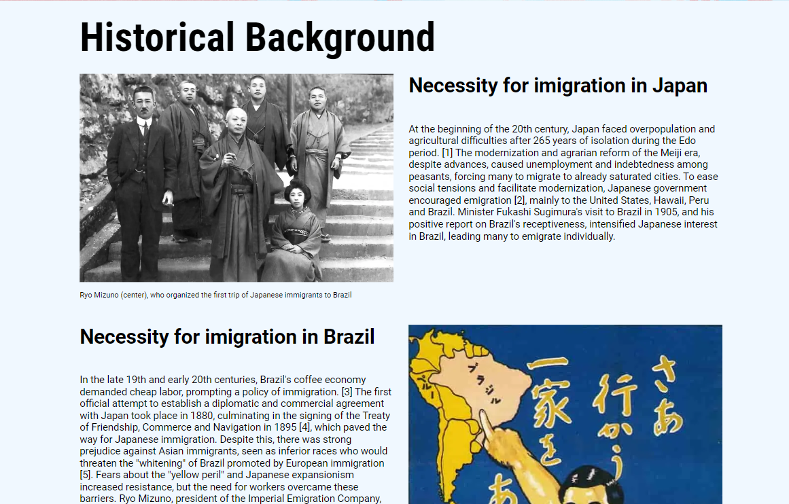
- Timeline
    - The timeline section provides historical information in a cronologic manner, taking advantage of the scrolling format of the page.
    - For each event on the timeline, there's a date, subtitle, text and one image of the period.
    - The timeline adjusts to the horizontal screens of desktops, while still keeping uniformity and flow.

    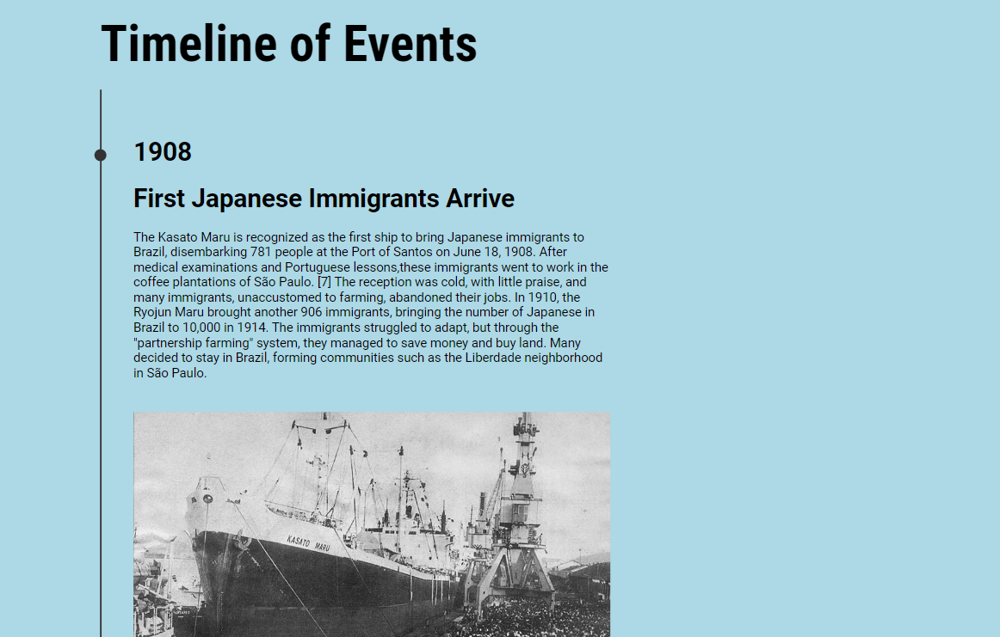
- Cultural Aspects
    - The "Culture" displays images and texts about different areas the japanese population influenced Brazil cultural scene.
    - It fits the cronological logic of the website, arriving on current topics.

    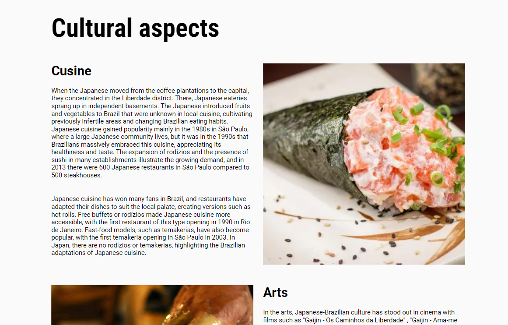
- Subscribe
    - The "Subscribe to out newsletter" section has a form to collect contact information from the users that are interested in receiving current information on the topic, cultural events and networking.
    - The form collect's the users' first and last name, email and in which language they would prefer to receive the newsletter in.
    - The form is valuable to the user as it gives the possibility of an extended contact with the Japanese Brazilian community beyond the website.

    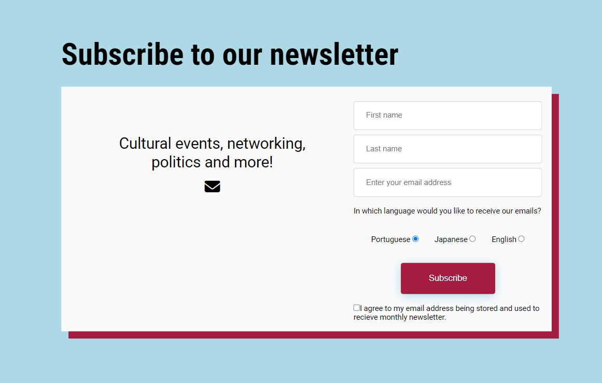
- References
    - The "References" section is a smaller and simpler section with listed references from the text in the above sections.
    - The links are responsive and change color of text and background when hovered (when viewed on a laptop or desktop)
    - All links open in a new page

    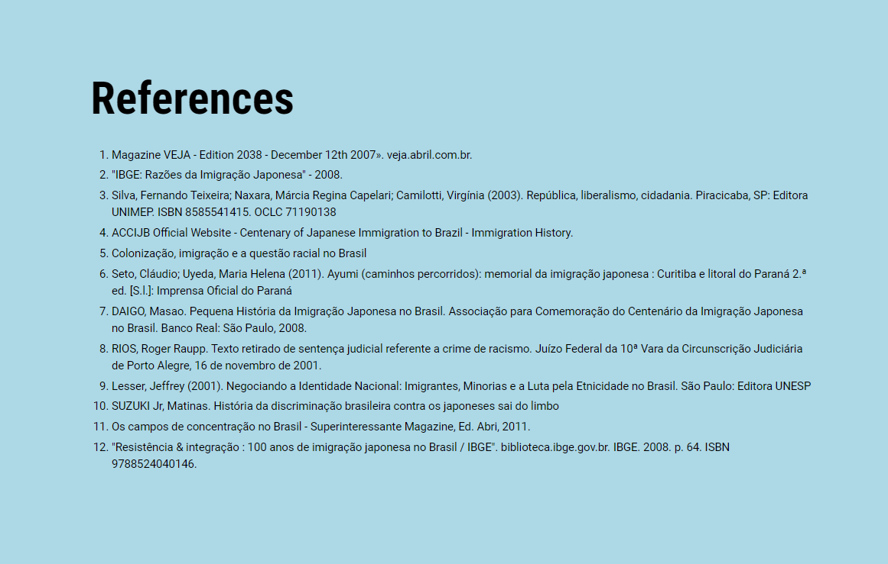
- Footer
    - The footer section includes links to the relevant websites within the topic of Japanese immigration to Brazil
        - Main Wikipedia article in English
        - Wikiwand article page
        - Japanese Embassy in Brazil 
    - The links will open to a new tab to allow easy navigation for the user.
    - The footer keeps the color scheme as the header, maintaining visual integrity.
    - The footer is valuable to the user as it encourages them to keep reading on the topic beyond the website.

 

## Testing
- I tested that this page works in different browsers: Chrome, Edge, Firefox and Safari.
- I tested that this page is responsive, functions and is comfortable to read in different screen sizes' widths:
    - 480px
    - 768px
    - 1208px
    - 1600px
- This was tested with mobile devices and laptops of different brands and sizes.
- I confirmed that all sections are readable and easy to understand.
- I confirmed that the form works:
    - Every input field is required.
    - The email input field will only accept an email.
    - One language is checked by default.
    - Autocomplete works
    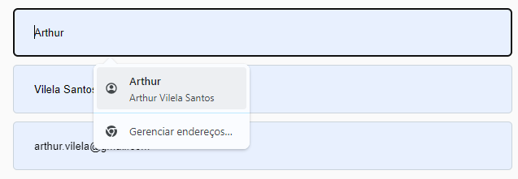

    ### Unfixed bugs
    - No known bugs were left unfixed.
## Bugs
- Solved bugs
    - After the first deployment, I noticed the placeholder in "First name" input field displayed "Last name".
    - I corrected the placeholder value in the HTML file to fix the problem.
    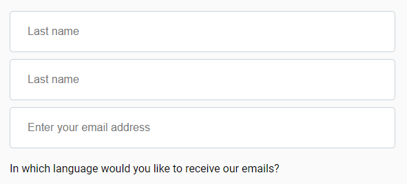
    - Banner image didn't load after substituting the file for a compressed version
    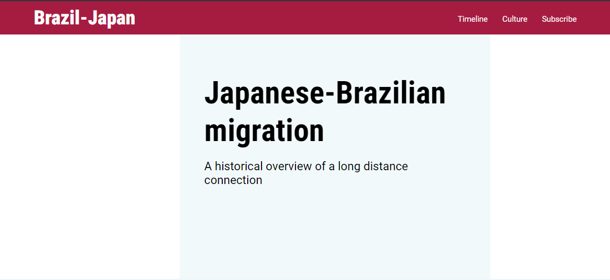
    - I corrected the file path on the CSS file, which solved the issue

        ```background: url(../images/banner.webp) no-repeat left center/cover;```
- Accesibility (solved) issues
    - Lighthouse indicated that the checkbox input in the form didn't have a label
    - I changed the text from a span to a label to fix the problem.
## Validator Testing
- HTML
    - No errors were found when validating the HTML code on the official W3C validator.
- CSS
    - No errors were found when validating the CSS code on the official W3C validator.

     

- Accessibility
    - Lighthouse in devtools indicated a high accessibility score
    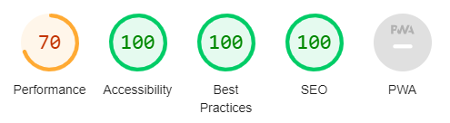
    - It also indicated a 69% "Performance" score, which was later barely increased. The low performance was mainly due to large image sizes
        - The banner image was the main responsible for slow loading time.
        - The banner image was subsequently compressed without visible visual quality loss and replaced in the assets folder.
        - The Performance score increased only 1%
## Deployment
The site was deployed to GitHub pages. 
The steps to deploy are as follows:
- In the GitHub repository, navigate to the Settings tab
From the source section drop-down menu, select the Master Branch
- Once the master branch has been selected, the page will be automatically refreshed with a detailed ribbon display to indicate the successful deployment.
- The live link can be found here 
    - https://arthur-vilela.github.io/PP1-japan-brazil-migration/

## Credits
### Content
- The content from the Cultural Background and Timeline section was summarized by me and originally taken from:
    https://pt.wikipedia.org/wiki/Imigra%C3%A7%C3%A3o_japonesa_no_Brasil
- The text was only later translated to English, since the Wikipedia article in Portuguese was much richer in content.
### Media
- The banner image is from this following article by Juliana Gomes: https://blog.meudna.com/imigracao-japonesa-criando-raizes-no-brasil/
    - I contacted the author, who let me use the image for this purpose. The image was created using IA tools, which render it copywrite free in Brazil.
- The other images are now in public domain, all taken from Wikipedia.

