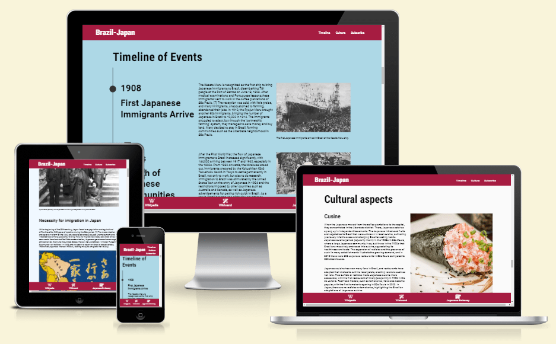
# Japanese - Brazilian migration

Japanese - Brazilian Migration is a website designed to inform people about the rich history of connection between these two countries from across the planet. It will be targeted for those who are interested in the topic, including pupils, researchers and history buffs. 
The website will be useful to understand:
- The before - what pushed people to leave their homes
- During - how was the migration and settling process
- and after - how did the population integrate and change its new home 

### Colour palette
- The colour scheme for this project was chosen to create uniformity and simplicity, at the same time keeping a high contrast ratio between text and background.
- The original idea of combining colours from both countries' flags did not work well for they were highly saturated and didn't relate well. So a wine colour was chosen instead of the intense pure red of the Japanese flag and a light blue  instead of the vivid blue of the Brazilian flag.

<div align="center">


</div>

### Favicon
- The favicon was created by combining both countries' flag for easy identification, to stay on theme and visually clear in small sizes.

<div align="center">

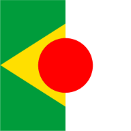

</div>

## Features

### Navigation bar
- It is fixed at the top of the page, allowing the user to always have access to the links, easing the navigation back and forth through website.
- It includes a link back to the top of the page on the left side.
- It includes three links to the different sections of the website: Timeline, Culture and Subscribe.
- The monochromatic and darker background provides contrast with the white text.
- The links are clear on their meaning and connection with their respective sections.
- The links are responsive on laptop and desktop screens, changing the text and background colour when hovered with the cursor.


### Banner

- The banner shows the name and theme of the website, informing the user what they can expect to find.
- The font and color scheme are kept in correspondence with the rest of the page.
- The image displayed is colorful and representative of the topic, showing a torii (traditional Japanese gate) and the MASP (São Paulo Art Museum), conveying visually the connection between Japan and Brazil as soon as the page opens.

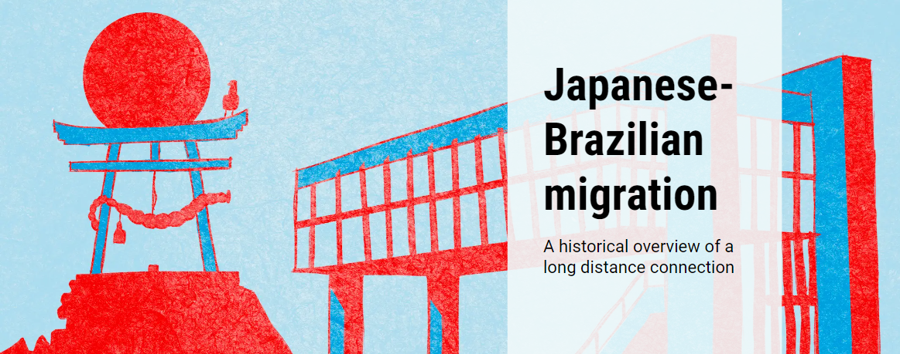
### Historical Background
- The "Historical Background" section of the page is a short introduction to the topic, improving understanding of the following timeline.
- It displays two historical images that draw the user's attention.

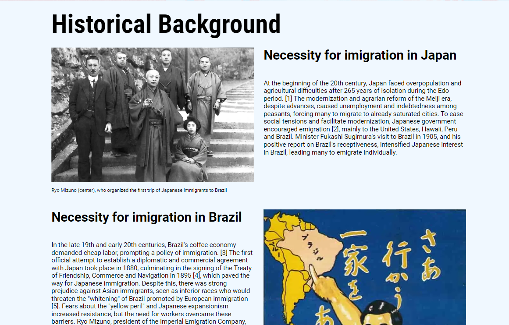
### Timeline
- The timeline section provides historical information in a chronologic manner, taking advantage of the scrolling format of the page.
- For each event on the timeline, there's a date, subtitle, text and one image of the period.
- The timeline adjusts to the horizontal screens of desktops, while keeping uniformity and flow.
- The timeline is valuable to the user because it effectively provides a visual layout of the chronological events that wouldn't be so clear in plain text. 

    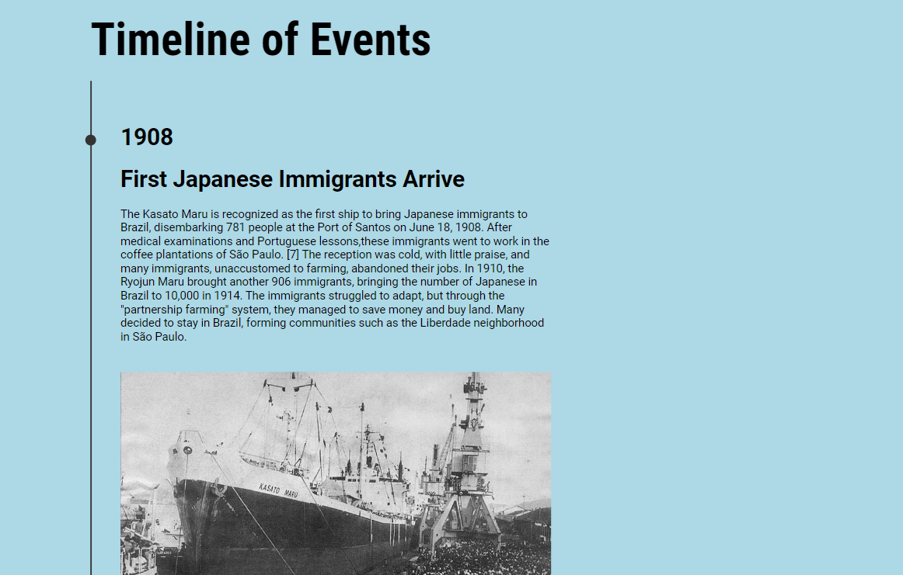
### Cultural Aspects
- The "Culture" displays images and texts about different areas the Japanese population influenced Brazil cultural scene.
- It fits the chronological logic of the website, arriving on current topics.
- This section is valuable to the user because it provides information beyond historical facts, it shows the consequences of the facts shown before, increasing their meaning.

    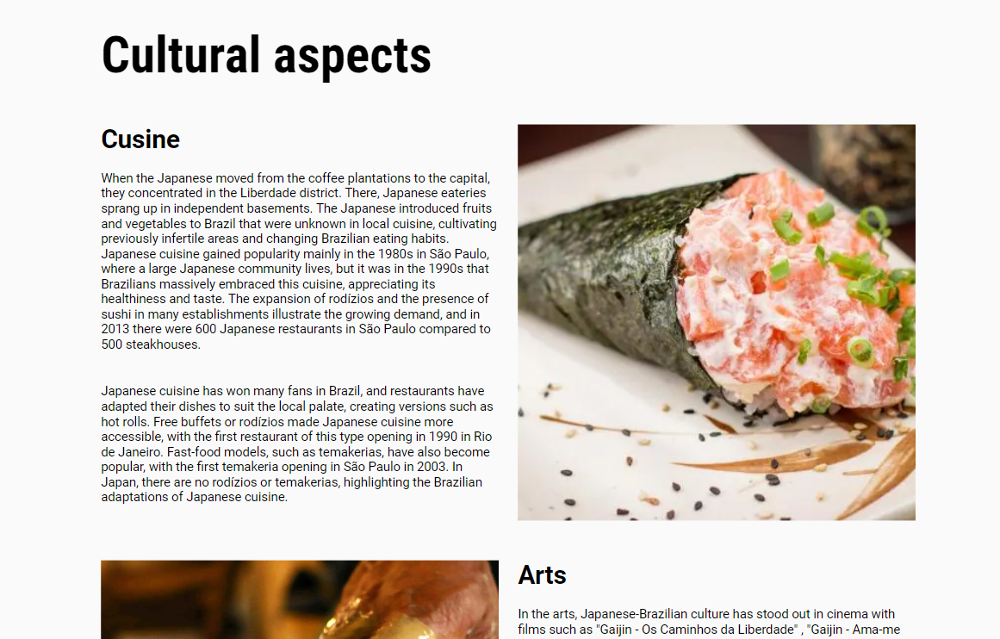
### Subscribe
- The "Subscribe to out newsletter" section has a form to collect contact information from the users that are interested in receiving current information on the topic, cultural events and networking.
- The form collect's the users' first and last name, email and in which language they would prefer to receive the newsletter in.
- The form is valuable to the user as it gives the possibility of an extended contact with the Japanese Brazilian community beyond the website.

    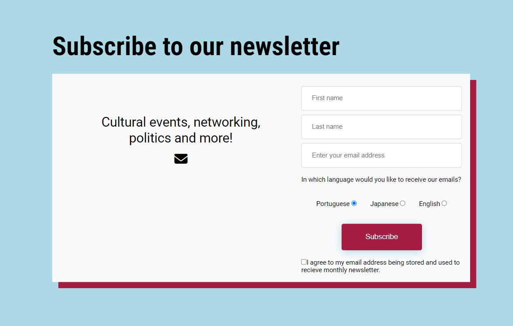
### References
- The "References" section is a smaller and simpler section with listed references from the text in the above sections.
- The links are responsive and change color of text and background when hovered (when viewed on a laptop or desktop)
- All links open in a new page
- The Reference section is valuable to the user because it provides validation to the information presented on the website, particularly useful for students and researchers who need to go deep in the topic or find sources for their projects.

    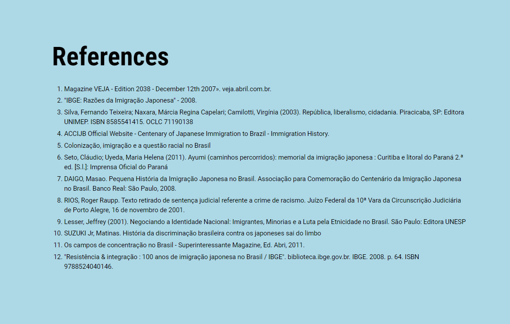
### Footer
- The footer section includes links to the relevant websites within the topic of Japanese immigration to Brazil
        - Main Wikipedia article in English
        - Wikiwand article page
        - Japanese Embassy in Brazil 
    - The links will open to a new tab to allow easy navigation for the user.
    - The footer keeps the color scheme as the header, maintaining visual integrity.
    - The footer is valuable to the user as it encourages them to keep reading on the topic beyond the website.

 

### Features left to implement
- One possible feature for the future would be to expand the "Cuisine" topic into a full section for Japanese-Brazilian cuisine.
- This could increase the number of users revisiting the website, improving traffic.

#### Recipes 
- A comparison between the Brazilian and the traditional Japanese recipes.
- A comparison between traditional Japanese ingredients and their Brazilian substitutes.
- Comment section for sharing cooking notes could increase user interaction.

#### Restaurants
- A  list of restaurants divided in traditional and Brazilian-Japanese.
- A map showing their location with direct links to the restaurants' website.

#### Events section
- A possible feature would be to list upcoming events related to the Japanese community in Brazil
- The list could be similar to the one sent on newsletters but could reach users who wouldn't like to subscribe to any more newsletters and just quickly check on the website.
- The events happening currently or very soon could also be displayed in a smaller side element on top of the page for a quick view to revisiting users.
## Technology Used
|Technology | Use|
|--|--|
|HTML| Structure the webpage
|CSS| Style and add layout to the project
|Font Awesome| Used for the footer icons
|GoogleFonts| Research, pair and add fonts to the project
|Adobe Illustrator| Create the favicon logo
|[Optimizilla](https://imagecompressor.com/)| Compress images
|[WEBP Converter](https://cloudconvert.com/webp-converter)| Convert jpg/png images to webp format


## Testing
|Test                           |Action                     | Expected result                |Outcome|
|-------------------------------|---------------------------|--------------------------------|-------|
|Display in different browsers  |Open and navigate on Chrome, Firefox, Edge and Safari|Similar experience in all browsers | Pass  |
|Display in different OS        |Open and navigate on Windows 11 and MacOS 13|Similar experience in all OS                | Pass
|Check responsiveness in different resolutions|Use Devtools to check visual result and usability in four different resolutions - 480px, 768px, 1208px, 1600px | Good visual and readability experience          | Pass
|Display in different devices | Open and navigate on Google Pixel 7, iPhone 13 and iPad Air|Similar experience in all devices| Pass
|Navigation links               | Click on navigation links | To be lead to their corresponding section                   | Pass
|Footer links                   | Click on footer link      |External websites opening in a separate tab                  | Pass
|Internal reference links       | Click on each internal link | To be directed to corresponding reference                 | Pass

### Form testing
- I confirmed that the form works:

|Test                                                           | Outcome|
|---------------------------------------------------------------|--------|
|Every input field is required                                  |Pass    |
|The email input field will only accept an email                |Pass    |
|One language is checked by default                             |Pass    |
|Autocomplete works on all tested browsers                      |Pass    |
|Subscription form submits when all criteria is filled correctly|Pass    |
|Name input fields don't accept inputs without letters          |Pass    |
|User prevented from submitting form without correct elements   |Pass    |

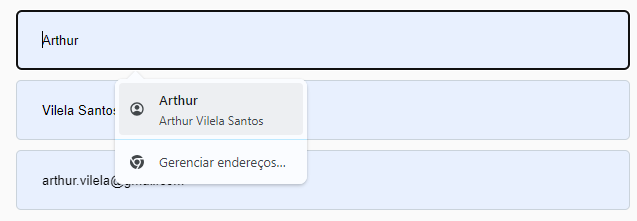

### Unfixed bugs
- No known bugs were left unfixed.
## Bugs
- Solved bugs
    - After the first deployment, I noticed the placeholder in "First name" input field displayed "Last name".
    - I corrected the placeholder value in the HTML file to fix the problem.
    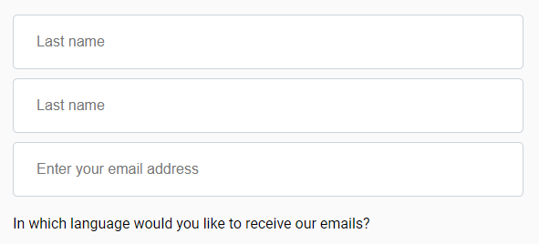
    - Banner image didn't load after substituting the file for a compressed version
    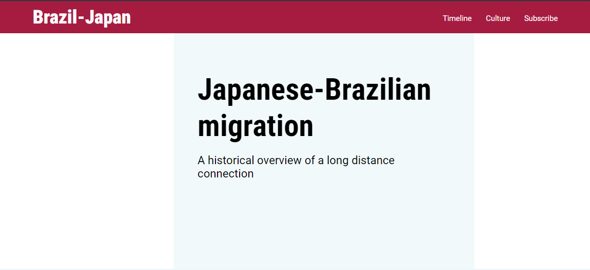
    - I corrected the [file path on the CSS file](https://github.com/arthur-vilela/PP1-japan-brazil-migration/blob/7cda0a09f16a1a8ba29f5660240882fa9fba8994/assets/css/style.css#L76), which solved the issue

        ```
        background: url(../images/banner.webp) no-repeat left center/cover;
        ```
    - "First name" and "Last name" input field accepted empty values if the user simply pressed "space"

    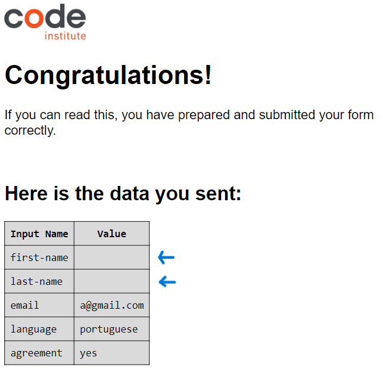

    - The bug was fixed by changing the HTML code of the input, [adding a pattern attribute](https://github.com/arthur-vilela/PP1-japan-brazil-migration/blob/7cda0a09f16a1a8ba29f5660240882fa9fba8994/index.html#L433-L436)

    ```
    <input type="text" class="text-input" name="first-name" id="first-name" placeholder="First name" autocomplete="given-name" pattern="[A-Za-z]" required>
    <input type="text" class="text-input" name="last-name" id="last-name" placeholder="Last name" autocomplete="family-name" pattern="[A-Za-z]" required>
    ```

- Accessibility (solved) issues
    - Lighthouse indicated that the checkbox input in the form didn't have a label
    - I changed the text [from a span to a label](https://github.com/arthur-vilela/PP1-japan-brazil-migration/blob/4a4018e676c9d80c04a9183b522f495568fb25a4/index.html#L457-L460) to fix the problem.
    ```
    <input type="checkbox" name="agreement" id="agreement" value="yes" required><label for="agreement" class="agreement">I agree to my email address being stored and used to receive monthly newsletter.</label>
    ```
## Validator Testing
### HTML
- No errors were found when validating the HTML code on the official W3C validator.
    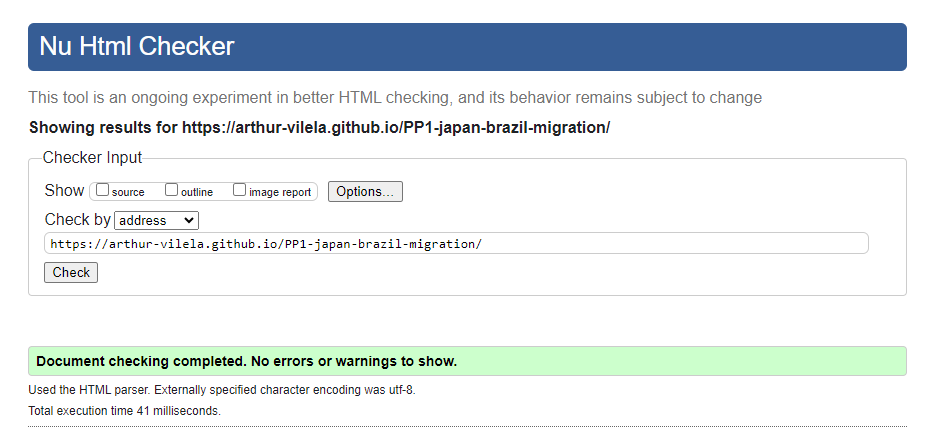
### CSS
- No errors were found when validating the CSS code on the official W3C validator.

     
     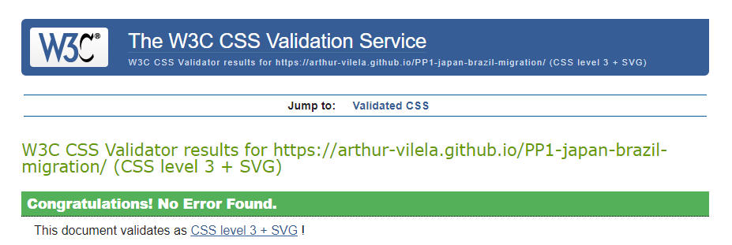

### Accessibility
- Lighthouse in devtools indicated a high accessibility score
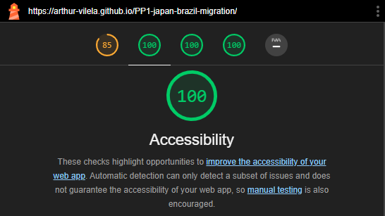
- At first try, it indicated a 66% "Performance" score, which was later increased. The low performance was mainly due to large image sizes
    - The banner image was the main responsible for slow loading time.
    - The banner image was subsequently compressed without visible visual quality loss and replaced in the assets folder.

    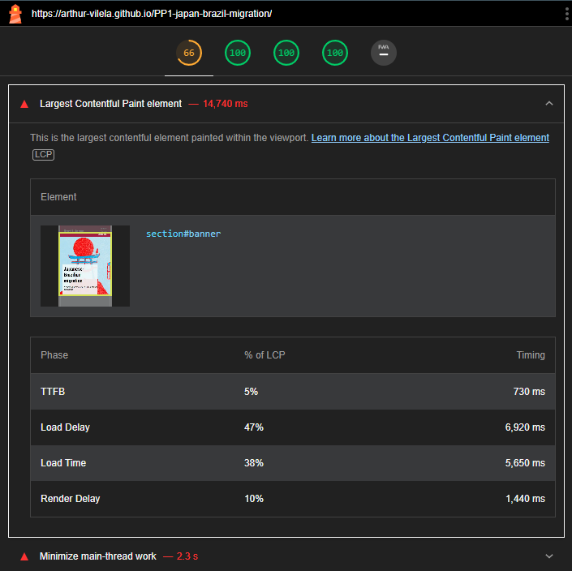

## Deployment
The site was deployed to GitHub pages. 
The steps to deploy are as follows:
- In the GitHub repository, navigate to the `Settings` tab
From the `Source` section drop-down menu, select the `Master Branch`
- In the next drop-down menu, select the `/root` option.
- Once the master branch has been selected, the page will be automatically refreshed with a detailed ribbon display to indicate the successful deployment.
- The live link can be found here 

    >https://arthur-vilela.github.io/PP1-japan-brazil-migration/

## Credits

### Content

- The content from the Cultural Background and Timeline section was summarized by me and originally taken from the [Wikipedia page on Japanese immigration to Brazil.](https://pt.wikipedia.org/wiki/Imigra%C3%A7%C3%A3o_japonesa_no_Brasil)
- The text was only later translated to English, since the Wikipedia article in Portuguese was much richer in content.

### Media

- The banner image is from this [article by Juliana Gomes](https://blog.meudna.com/imigracao-japonesa-criando-raizes-no-brasil/)
    - I contacted the author, who let me use the image for this purpose. The image was created using IA tools, which render it copywrite free in Brazil.

#### Links

|File|Author|Link|
|--|--|--|
| banner.webp | Juliana Gomes | https://blog.meudna.com/imigracao-japonesa-criando-raizes-no-brasil/|
|ceramic.webp | Regiane Tosatti | https://www.pexels.com/pt-br/foto/fotografia-com-foco-seletivo-de-pessoa-moldando-argila-22823/|
|history-bottom | unknown | https://pt.wikipedia.org/wiki/Imigra%C3%A7%C3%A3o_japonesa_no_Brasil |
history-intro | unknown | https://pt.wikipedia.org/wiki/Imigra%C3%A7%C3%A3o_japonesa_no_Brasil |
|judo.webp | Kampus Production | https://www.pexels.com/pt-br/foto/homem-mulher-esporte-luta-6765030/ |
temaki.webp | unknown | https://globorural.globo.com/vida-na-fazenda/receitas/noticia/2021/07/comida-japonesa-com-jeitinho-brasileiro-como-fazer-temaki.html |
timeline-1908.webp | unknown | https://en.wikipedia.org/wiki/Kasato_Maru |
timeline-1920.webp | unknown | https://pt.wikipedia.org/wiki/Imigra%C3%A7%C3%A3o_japonesa_no_Brasil |
timeline-1930.webp | unknown | https://pt.wikipedia.org/wiki/Imigra%C3%A7%C3%A3o_japonesa_no_Brasil
timeline-1940.webp | Vinicius Fontana | https://g1.globo.com/mundo/noticia/2020/08/29/campo-de-concentracao-na-amazonia-aprisionou-centenas-de-familias-japonesas-durante-2a-guerra.ghtml
timeline-1980.webp | Almeida Rocha | https://pt.wikipedia.org/wiki/Imigra%C3%A7%C3%A3o_japonesa_no_Brasil
timeline-post-ww2.webp | Caio do Valle | https://commons.wikimedia.org/wiki/File:Liberdade_sao_paulo.jpg


### Code
-  The original code for the dots and vertical line in the Timeline section was created using Copilot.
```
.timeline .event::before {
    content: "";
    position: absolute;
    left: -10px;
    top: 0;
    width: 10px;
    height: 10px;
    background-color: #333;
    border-radius: 50%;
}
```
- The line created did not align well so I modified it to actually align the dots' position to the line and adjust its size, fitting different screen sizes.
```    
.timeline .event::before {
        content: "";
        position: absolute;
        left: -39px;
        top: 55px;
        width: 35px;
        height: 35px;
        background-color: #333;
        border-radius: 50%;
    }
```
### Readme.md
- The base for the README.md file was taken from [Code Institute readme template](https://github.com/Code-Institute-Solutions/readme-template) on Github. 
- The template for the table on the Testing section was found on [stackedit.io](https://stackedit.io/)
- Some tested items were taken from my mentor Alan Bushell PP1 project README.md file
